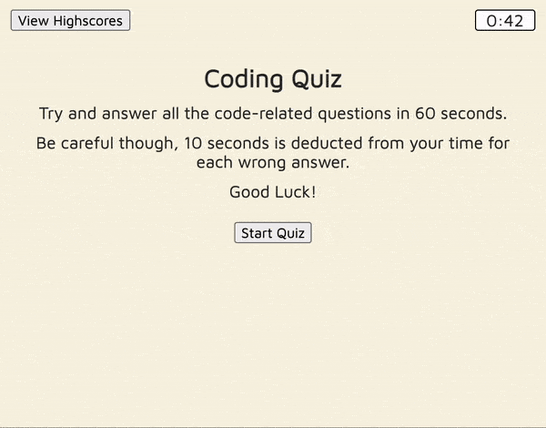

# CodingGetGood
A timed quiz application for ironing out web development theory.

## Functionality
The quiz is fully functional, with an asthetic and friendly UI. Users can take the quiz with the click of a button, as well as save or remove their high score to or from local storage. Feedback as to whether the user chose the correct answer is also provided for each question.

## Preview

Below is a gif detailing the basic workings of the applicaiton.

## Access
To use the application, follow this link: https://kbario.github.io/CodingGetGood/